# Vault Claude

An [Obsidian](https://obsidian.md) sidebar chat that runs your locally installed Claude Code in the vault, through the Claude Agent SDK. It uses the same sign-in as the `claude` CLI, so a Claude subscription works without an API key.

Built by **Claude Opus 5** (`claude-opus-5`) and **Claude Opus 5.5** (`claude-opus-5-5`) in Claude Code.

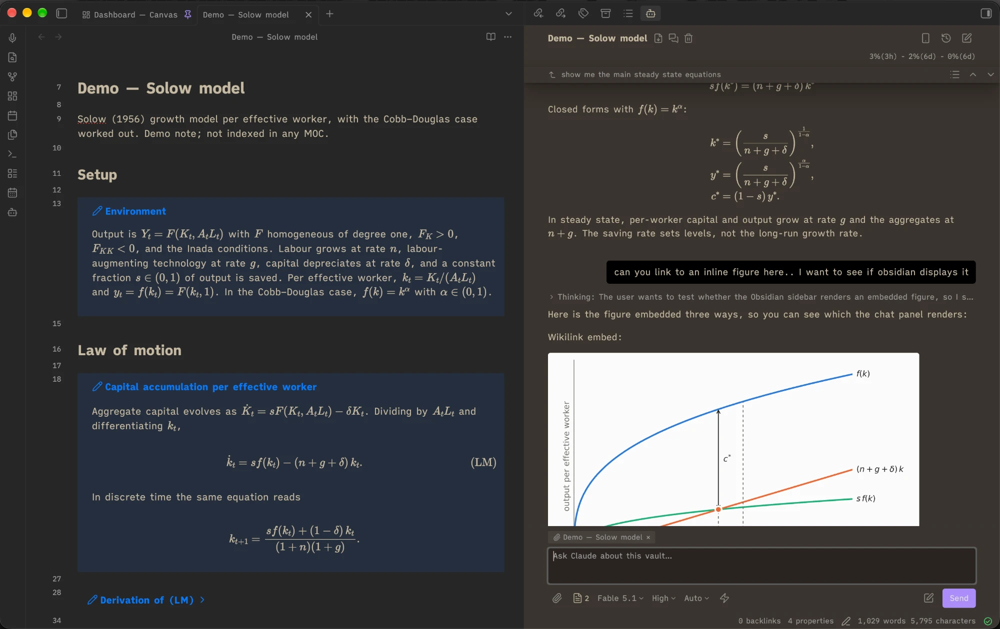

## Features

Open the chat from the robot icon in the left ribbon.

**Chatting**
- Replies render as Obsidian Markdown: wikilinks, callouts, math and images from the vault. A note name Claude writes in bold or as code opens the note; hold ⌘ over it to preview. Thinking and tool calls fold into one "Steps" line.

- **At the end of each reply**, a card lists the files it changed, with lines added and removed. Click a file for its diff, its name to open it, or a diff line to open the note at that line.

  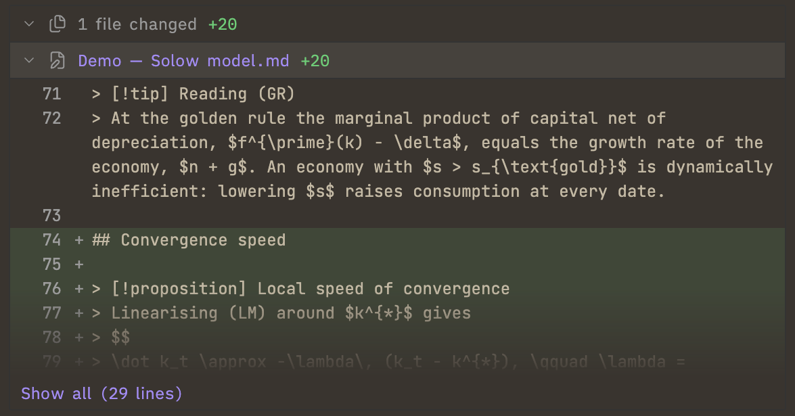

- **The chip above the input** holds the chat's attached note: + attaches the open note, × detaches it. Lines you select in that note go with your message. Type `@` to mention other notes, files or folders; the paperclip, paste or drag and drop attach files.

  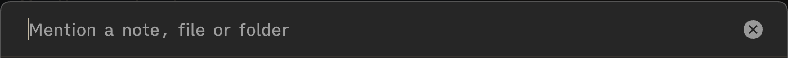

- A message sent while Claude works is queued; **send now** on its bubble delivers it at once.
- **The pencil button beside Send** writes your message in a draft note, sent from the line above the input or thrown away with its ×.

  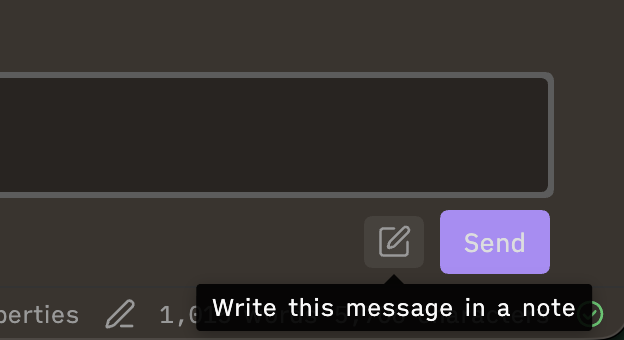

- **The bar at the top of the chat** shows which of your messages is being answered. Its arrows (⌥↑/⌥↓) step between your messages, and its list button shows them all. ⌘F finds in the chat.

  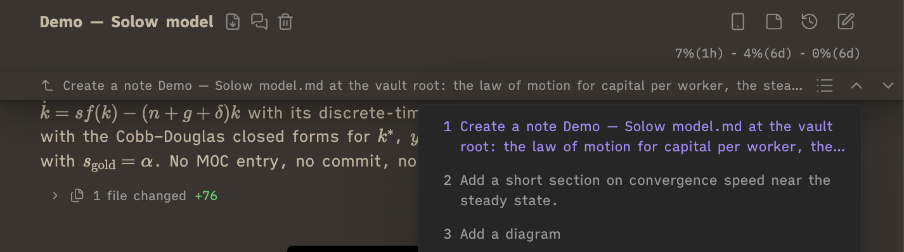

- **Long chats** open on their last ten exchanges and draw the rest as you scroll up.

- **Select text in a reply** for a **Quote** button; equations are quoted as LaTeX.

  

- **Side chat:** ask about the chat without changing it, from the button beside Quote or beside the chat title. Paste or drop images on it to ask about them. It knows the conversation so far, runs in Plan mode so it changes nothing, and is deleted when closed unless you choose **Keep as a chat**.

  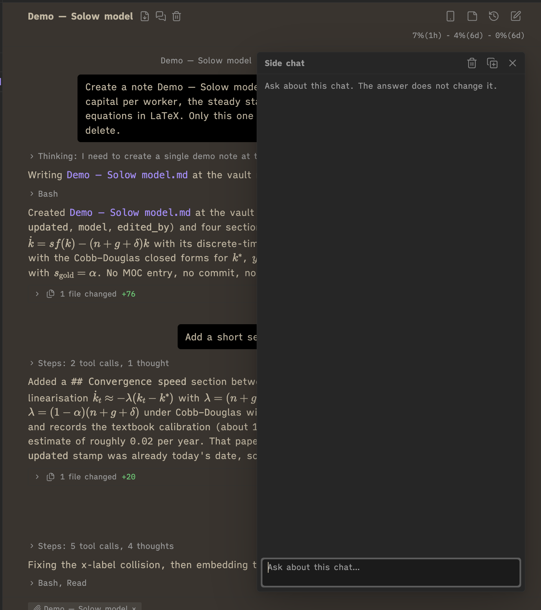

- **Buttons under a reply** reply to it, copy it, insert it into a note, or branch the chat from there. Checkboxes in replies can be ticked.

  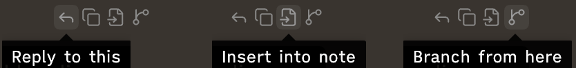

- A system notification arrives when a long reply finishes or Claude needs approval while Obsidian is in the background.

**Working from notes**
- **Right-clicking selected text in a note:** Ask Claude about selection, and Edit with Claude (a word diff to accept).

  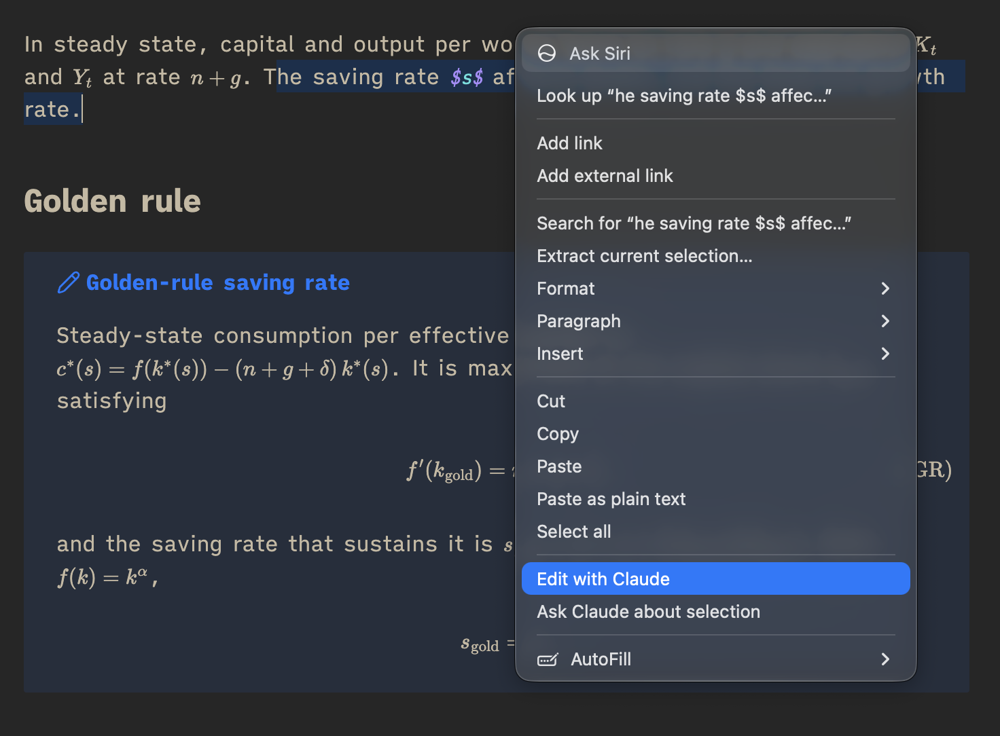

  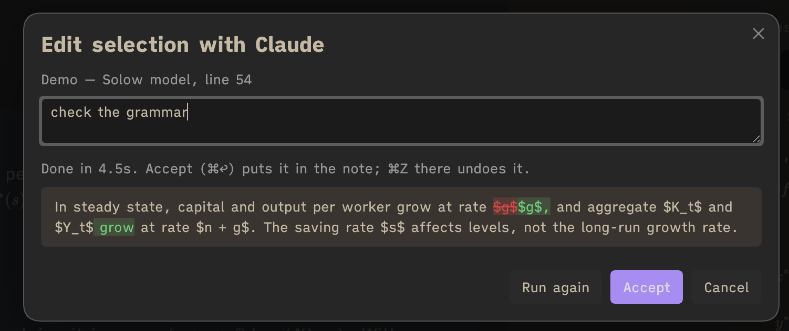

- **A file's menu** (right-click in the file explorer, or a note's ⋯ menu): Attach to Claude, for notes, files and folders; for a note, also Send to Claude as a prompt.

  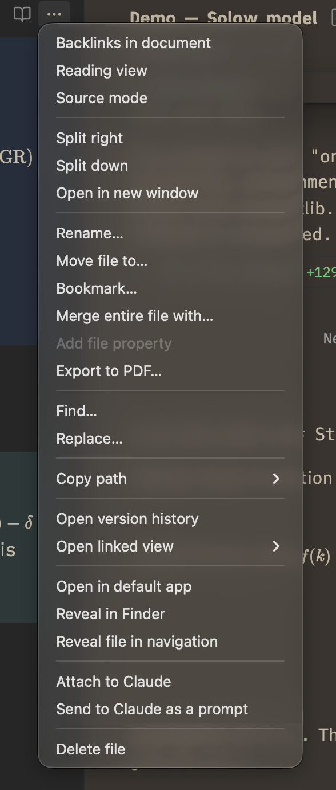

- Ask Claude about selection, Edit selection with Claude and Send this note to Claude as a prompt are also commands.

**Controls**
- **Under the input:** the chat's model, effort and permission mode, and the ⚡ fast-mode toggle. Approvals appear in the chat.
- **The meter under the title** shows context and plan usage, with the time to each reset; point at it for details. A dashed line in the chat marks where Claude Code compacted it.

  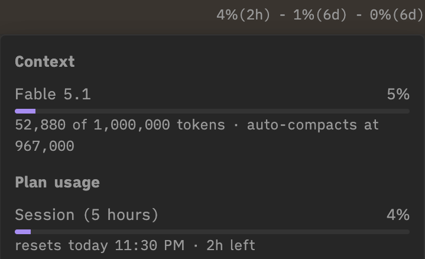

- **Settings** hold the defaults for new chats and deny rules that apply in every mode (by default `git checkout/reset/restore/clean` and `rm -rf`).

**Chats**
- **The clock icon, top right, opens the history.**
  - Search chats by title, prompt or reply. Each row has pin, rename and delete buttons; ⌘↵ or ⌘-click opens a chat in a new tab.
  - **Tab** lists chats by note: type part of a note's name or folder to see the chats that changed it, were sent it, or mentioned it. More words filter by chat title (`with:solow diagram`); ⌘↵ opens the note.
  - Beside each date is the chat's status: grey ○ for open or in the background; accent ● for working, waiting for approval, background tasks, or a new reply. No mark means closed.
  - With **History includes all vault sessions** on, chats started outside the panel (in the desktop app or a terminal) are listed too, in italics. One opens as a copy, so that two programs never write to one session: its row says how often it was copied, each copy says it is one, and opening it again offers your latest copy.

  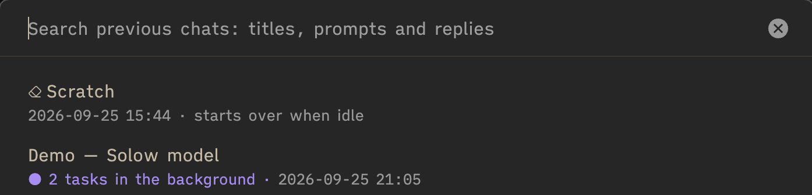

- **The new-chat button, top right,** starts a chat; ⌘-click opens it in a new tab. A chat you leave keeps working in the background, and each chat keeps its unsent text and attached note. Point at a tab's icon for its chat's name.

  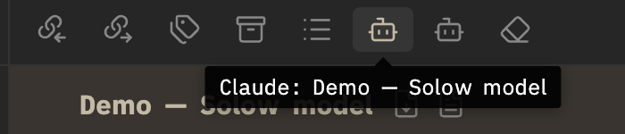

- **Background agents** keep running after a reply ends. **Stop N tasks** beside Send, or ■ in the history, stops them; a dot on the tab icon shows while they run.

  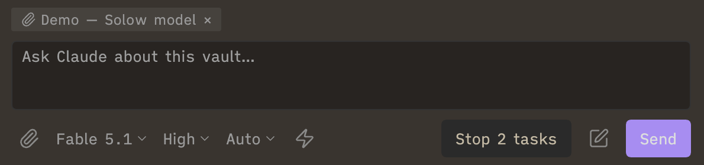

- **Notes ↔ chats**
  - With a note open, **a line above the input** lists the chats that changed it or were sent it; ⌥-click one to take it off the note. `with:` in the history finds any note's chats.

    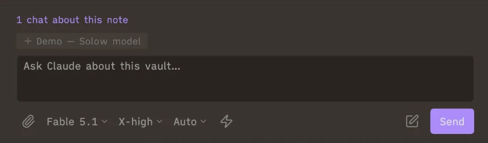

  - **The document icon beside the paperclip** lists the notes the chat changed or mentioned. Click one to open it, ⌥-click to attach it.

    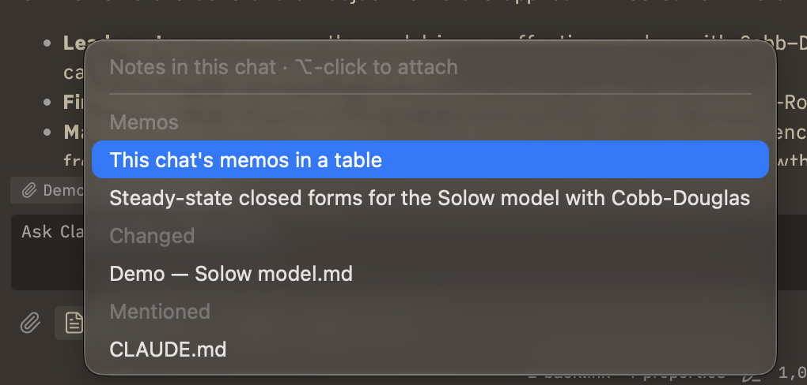

- **Scratch chat:** a standing chat for odds and ends, first in the history. It starts over after 24 hours unused (adjustable) or from its trash button. **Continue as a chat**, under a scratch reply, copies it up to there into a chat of its own.
- **Beside the chat title:** save the chat, or a summary of it, as a note, and delete it.
- **Copy from here on:** the arrow to the left of one of your messages copies the chat from that message on into a new chat.

  

**Phone**
- **The phone icon, top right,** puts a chat on the Claude app or claude.ai/code via Remote Control, and takes it off again.

  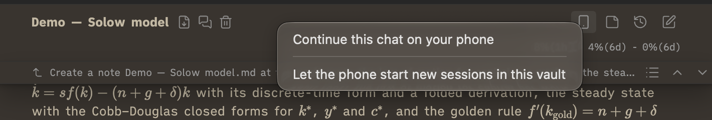

**Safety**
- Remote images in replies are shown as links, not loaded.
- Bypass mode is off unless enabled in settings, and never runs from the phone.
- Closing a panel hands its running chats to another Claude panel, or stops them if there is none. Every Claude process ends when Obsidian quits.
- Chats are saved as they go, so one reopened from the history carries on where it stopped.

## Keyboard

| Keys | In the panel |
| --- | --- |
| ⌘↩ (Ctrl+Enter on Windows) | Send; plain ↩ sends instead when the setting is off |
| ↑ in the empty input | Bring back the last message you sent |
| Esc | Stop the reply (background tasks keep running); close the side chat |
| ⌥↑ / ⌥↓ | Previous / next message you sent |
| ⌘F | Find in the chat; ↩ and ⇧↩ move between matches, Esc closes |
| ⌘-click the new-chat button | New chat in a new tab |
| ⌘-click / ⌥-click a note in the notes menu | Open it in a new tab / attach it as an `@` mention |
| ⌘ + pointer on a link or file name | Preview the note |
| ⌘-click a line of a diff | Open the note at that line in a new tab |

## Your data

- **Conversations** are Claude Code's own session files, in `~/.claude/projects/` on your computer, outside the vault. Deleting a chat from the history deletes its file.
- **The plugin's data file**, `<vault>/.obsidian/plugins/vault-claude/data.json`, holds the settings and each chat's title, pin, unsent text, attached note, note links and ticked checkboxes. A chat's entries go when it is deleted. Obsidian Sync copies the file if it syncs plugin settings.
- **The diagnostic log** records process starts, stops and errors, with session ids and paths (the vault's and Claude Code's), never message text: `~/Library/Logs/vault-claude.log` on macOS, `%LOCALAPPDATA%\vault-claude\vault-claude.log` on Windows, `~/.local/state/vault-claude/vault-claude.log` on Linux.
- Nothing is sent anywhere but through Claude Code itself.

## Requirements

- Obsidian desktop on macOS or Windows.
- Claude Code, installed with the [native installer](https://docs.claude.com/en/docs/claude-code/setup) and signed in (run `claude` once in a terminal and log in):
  - macOS: `curl -fsSL https://claude.ai/install.sh | bash`
  - Windows (PowerShell): `irm https://claude.ai/install.ps1 | iex`. Claude Code on Windows also needs [Git for Windows](https://git-scm.com/downloads/win). An npm install of Claude Code (`claude.cmd`) does not work with the plugin on Windows.
- Node.js 18 or later, only to build from source.

## Installation

### From a release (no build needed)

1. Download `main.js`, `manifest.json` and `styles.css` from the latest [release](https://github.com/manuelamador/obsidian-vault-claude/releases).
2. Put them in `<vault>/.obsidian/plugins/vault-claude/`, creating the folder. The `.obsidian` folder is hidden: in Finder, ⌘⇧. shows it; in File Explorer, turn on View → Show → Hidden items.
3. In Obsidian, open **Settings → Community plugins**, turn off Restricted mode if it is on, and enable **Vault Claude**.
4. Open the chat with the robot icon in the left ribbon, or the command **Vault Claude: Open chat**.

### From source

macOS:

```bash
npm install
npm run build
mkdir -p <vault>/.obsidian/plugins/vault-claude
cp main.js manifest.json styles.css <vault>/.obsidian/plugins/vault-claude/
```

Windows (PowerShell):

```powershell
npm install
npm run build
New-Item -ItemType Directory -Force "<vault>\.obsidian\plugins\vault-claude"
Copy-Item main.js, manifest.json, styles.css "<vault>\.obsidian\plugins\vault-claude\"
```

Then enable and open it as in steps 3 and 4.

The plugin finds Claude Code in `~/.local/bin` (`%USERPROFILE%\.local\bin\claude.exe` on Windows), Homebrew's folders or PATH; otherwise set its path under **Settings → Vault Claude → Claude Code executable**.

**Updating:** replace the three files with a newer release's, then switch the plugin off and on.

## Settings

| Setting | What it does |
| --- | --- |
| Claude Code executable | Path to `claude`; detected automatically when empty |
| Default model, effort, permission mode | Starting values for new chats. **Default** is Claude Code's default model; **Claude Code's setting** runs the model Claude Code's own settings name, when they name one |
| Files left out of a chat's notes | Patterns of notes not listed (default `*attachments/*`) |
| Scratch chat | Offer the scratch chat in the history, an empty chat and the new-chat menu (default on) |
| Scratch chat starts over after | 1 hour to 1 week unused (default 24 hours) |
| Side chat knows | The whole chat it was opened from (default), or only what you ask it |
| Model for small jobs | Model for Edit selection with Claude, Save summary as note and the scratch chat (default Sonnet) |
| Offer bypass permissions | Adds Bypass to the mode menus |
| Deny rules | Actions refused in every mode, one rule per line |
| Tool calls | Summary, one line each, or hidden |
| Panel side margins | 8–96 px |
| Send with ⌘+Enter (Ctrl+Enter on Windows) | Otherwise Enter sends |
| Attach the open note to new chats | Off: a new chat starts with no note, and the chip offers the open one |
| History includes all vault sessions | Also list sessions started outside the panel |
| Folder for saved chats | Where Save chat as note and Save summary as note write (default `Claude chats`) |
| Notify when Claude finishes, Notify after | Notifications for long replies and approvals while Obsidian is in the background (default on, 30 s) |
| Phone access | Put every new chat on the phone, name in the Claude app, start with Obsidian |
| Extra PATH entries | Directories added to PATH for commands Claude runs |

## Commands

Open chat · New chat · New chat in a new tab · Edit selection with Claude · Find in chat · Go to previous / next message you sent · List messages you sent · Write this message in a note · Send the draft note · Send this note to Claude as a prompt · Quote the selected chat text in your next message · Open side chat · Open scratch chat · Clear scratch chat · Toggle fast mode · Chat history · Focus chat input · Stop Claude · Rename chat · Branch this chat into a new tab · Save chat as note · Save chat summary as note · Ask Claude about selection · Take all chats off the phone · Toggle phone access (Remote Control)

## Limitations

- Each open or working chat runs its own Claude Code process (about 360 MB).
- Background tasks end when Obsidian quits or the last Claude panel closes.
- Each chat put on the phone appears as its own session in the Claude app.
- Tested on macOS. Windows support is built in but has not yet been run on a Windows machine; Linux is untested.

## Troubleshooting

- **The panel stays blank after an update:** close its tab and open it again from the ribbon.
- **"Claude Code executable not found":** install Claude Code with the native installer (see Requirements), or set its path under **Settings → Vault Claude → Claude Code executable**.
- **A notice that Claude Code is far from the plugin's SDK version:** update Claude Code (`claude update`), or the plugin if Claude Code is ahead.
- **Windows, with Claude Code installed through npm:** the plugin cannot start `claude.cmd`; install it with the native Windows installer, which provides `claude.exe`.
- **Anything else:** attach the diagnostic log (see Your data) to a bug report; it holds your vault's path.

## License

[MIT](LICENSE). The workarounds for Obsidian's renderer in `esbuild.config.mjs`, `src/electronCompat.ts` and `src/session.ts` follow [Claudian](https://github.com/YishenTu/claudian) (MIT).
