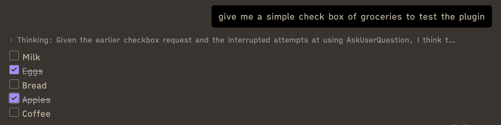
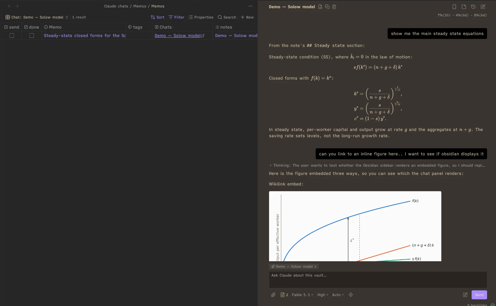
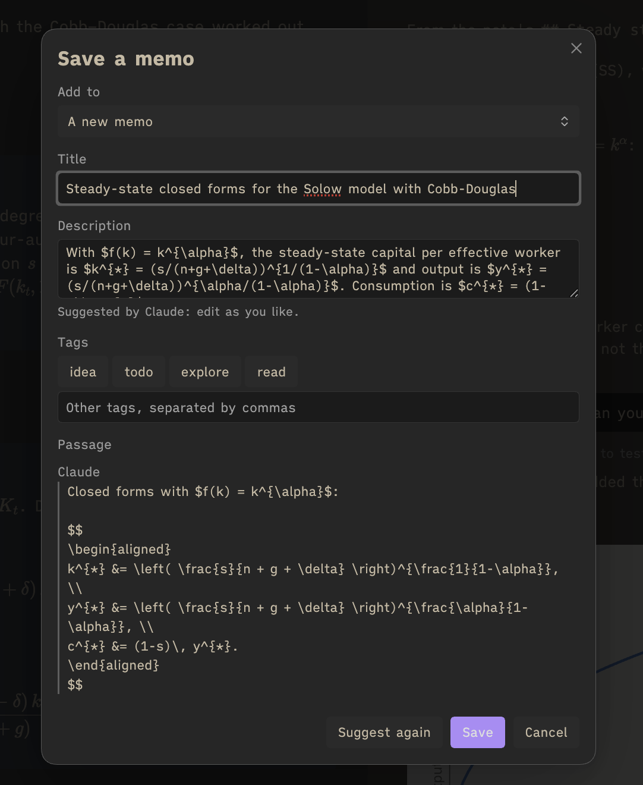
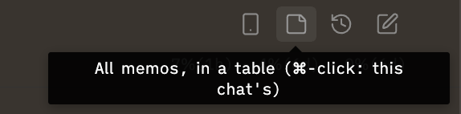
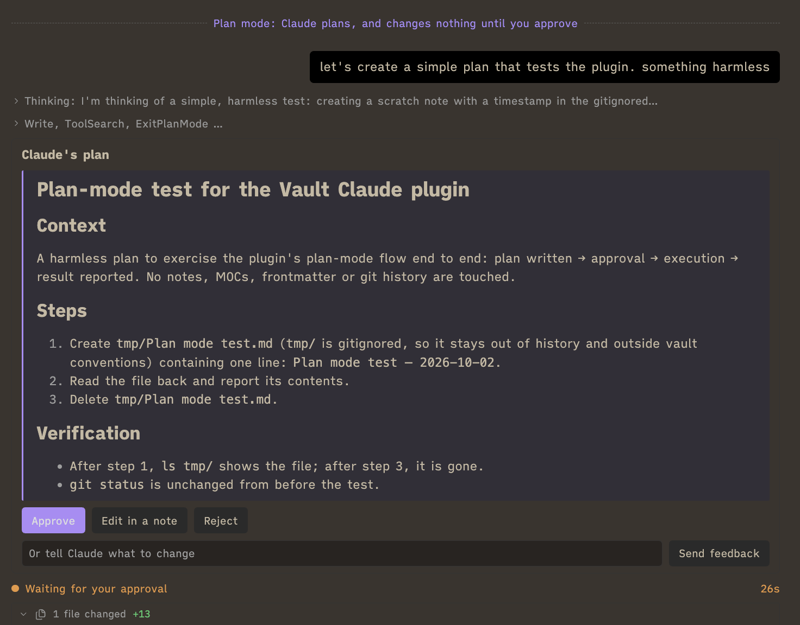
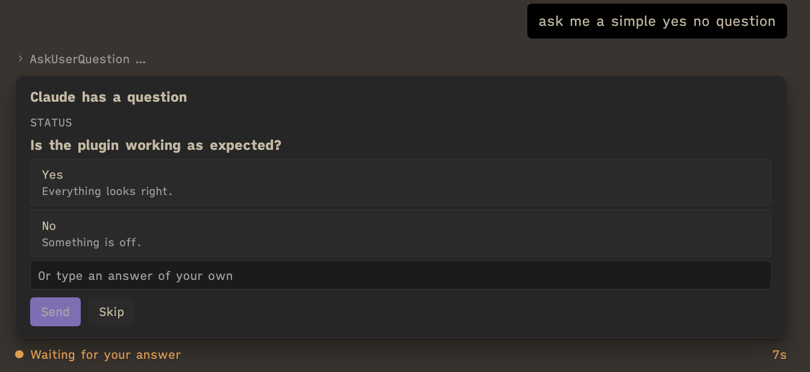

# Vault Claude

An [Obsidian](https://obsidian.md) sidebar chat that runs your locally installed Claude Code in the vault, through the Claude Agent SDK. It uses the same sign-in as the `claude` CLI, so a Claude subscription works without an API key.

> [!NOTE]
> This plugin was built for my own personal use. Use it at your own risk.

Built by **Claude Opus 5** (`claude-opus-5`) and **Claude Opus 5.5** (`claude-opus-5-5`) in Claude Code.


## Requirements

- Obsidian desktop on macOS or Windows.
- Claude Code, installed with the [native installer](https://docs.claude.com/en/docs/claude-code/setup) and signed in (run `claude` once in a terminal and log in):
  - macOS: `curl -fsSL https://claude.ai/install.sh | bash`
  - Windows (PowerShell): `irm https://claude.ai/install.ps1 | iex`. Claude Code on Windows also needs [Git for Windows](https://git-scm.com/downloads/win). An npm install of Claude Code (`claude.cmd`) does not work with the plugin on Windows.
- Node.js 18 or later, only to build from source.

## Installation

### From a release (no build needed)

1. Download `main.js`, `manifest.json` and `styles.css` from the latest [release](https://github.com/manuelamador/obsidian-vault-claude/releases).
2. Put them in `<vault>/.obsidian/plugins/vault-claude/`, creating the folder. The `.obsidian` folder is hidden: in Finder, ⌘⇧. shows it; in File Explorer, turn on View → Show → Hidden items.
3. In Obsidian, open **Settings → Community plugins**, turn off Restricted mode if it is on, and enable **Vault Claude**.
4. Open the chat with the robot icon in the left ribbon, or the command **Vault Claude: Open chat**.

### From source

macOS:

```bash
npm install
npm run build
mkdir -p <vault>/.obsidian/plugins/vault-claude
cp main.js manifest.json styles.css <vault>/.obsidian/plugins/vault-claude/
```

Windows (PowerShell):

```powershell
npm install
npm run build
New-Item -ItemType Directory -Force "<vault>\.obsidian\plugins\vault-claude"
Copy-Item main.js, manifest.json, styles.css "<vault>\.obsidian\plugins\vault-claude\"
```

Then enable and open it as in steps 3 and 4.

The plugin finds Claude Code in `~/.local/bin` (`%USERPROFILE%\.local\bin\claude.exe` on Windows), Homebrew's folders or PATH; otherwise set its path under **Settings → Vault Claude → Claude Code executable**.

**Updating:** replace the three files with a newer release's, then switch the plugin off and on.

## Features

Open the chat from the robot icon in the left ribbon.

### Chatting

- **Replies that fit your vault.** Obsidian Markdown renders wikilinks, callouts, equations and local images. Thinking and tool calls fold into a single Steps line.
- **See what changed.** Each reply lists the files it changed, with diffs you can open at the affected line.
- **Explore a reply.** Quote selected text, ask a side question, or use the reply buttons to copy, insert, save or branch. Side chats can use the conversation so far and are deleted when closed unless you keep them.

<details>
<summary>Reply tools and navigation</summary>

- Click a changed file's card to see its diff, its name to open it, or a diff line to open the note there.

  

- File names in bold or code, written with their extension (`Notes.md`), open the file; wikilinks open their note, bold or not. Hold ⌘ over one to preview it.
- Select text for **Quote**, **Side chat** and **Memo**. Equations are quoted as LaTeX.

  

- Open a side chat beside Quote or the chat title. It runs in Plan mode without changing your notes; paste or drop images to ask about them. Choose **Keep as a chat** to retain it.

  

- Buttons under a reply let you reply to it, copy it, insert it into a note, save it as a memo, or branch from there.

  

- Ticked checkboxes persist when you reopen the chat, including after a restart. These are your own marks: Claude learns about them only if you send a message. Copying, inserting or saving a reply includes its current ticks; later ticks do not update that note.

  

- The bar above the chat identifies the message being answered. Use its arrows (⌥↑/⌥↓) to move between your messages, its list to see them all, or ⌘F to search.

  

- Long chats open on their last ten exchanges; scroll up to draw earlier ones.
- Messages sent while Claude works are queued. **send now** on a bubble delivers it at once.
- The pencil beside Send writes your message in a draft note. Send it from the line above the input or discard it with ×.

  

</details>

<details>
<summary>Adjusting equation size</summary>

Obsidian draws equations at a fixed 113.1% of the text size without measuring the font. If they look small, this CSS snippet makes them 5% larger in notes and the panel. Add it under **Settings → Appearance → CSS snippets**:

```css
mjx-container.MathJax { font-size: calc(113.1% * 1.05) !important; }
```

</details>

### Working with notes

- **Bring notes into the conversation.** Attach the open note, include selected text, or mention notes, files and folders with `@`. Add files and images through the paperclip, paste or drag and drop; hover over a chip to see what accompanies your message.
- **Edit a selection.** Right-click text in a note to ask Claude about it or request an edit, then review the word diff before accepting.

  

- **Send a note as a prompt.** A note's file menu can attach it or send its contents as your next message.

<details>
<summary>Attachments and note menus</summary>

- The attached-note chip above the input uses **+** to attach the open note and **×** to detach it. The note goes by its path; selected lines go as text.
- Type `@` to mention another note, file or folder. A mentioned note sends its text and shows an approximate token count. Its **×** switches to sending only the path; click the chip to include its text again. Other files and folders go by their paths.

  

- Right-click selected text for **Ask Claude about selection** or **Edit with Claude**.

  

- Right-click a file in the explorer, or open a note's ⋯ menu, for **Attach to Claude**. Notes also offer **Send to Claude as a prompt**.

  

- Asking about a selection, editing it and sending a note as a prompt are also available as commands.

</details>

### Memos

**Save ideas as notes linked to their source.** Turn selected passages or a reply into a memo, with a title, description and tags, or save a quick bookmark. Memos are ordinary notes in `Claude chats/Memos/` in your vault (**Folder for memos** in the settings), beside the Memos table, `Memos.base`. Browse memos by chat, note or tag in the Memos table, and return to the conversation where each passage came from.



<details>
<summary>Saving and using memos</summary>

- Choose **Memo** over a chat selection or the sticky-note icon under a reply. A selection spanning messages keeps a passage for each, labelled You or Claude; a reply's memo includes your prompt and the reply. Equations stay as LaTeX.
- Claude's model for small jobs suggests a title and description for you to edit. Add tags such as idea, todo, explore, read or bookmark, or your own. You can also add passages to an existing memo.

  

- For a quick bookmark, save with the title empty or ⌥-click (Alt-click) Memo or the reply's sticky-note icon to skip the form. The first words become its title, with a timestamp if needed; it gets the `bookmark` tag and appears in Bookmarks.
- Memo properties identify the source chats and link to the attached note and notes mentioned in the passages, creating backlinks.
- **Go to the passage** opens the source message, drawing earlier turns if needed or searching its words if the message is missing. **Continue in the chat** opens the chat with the passage quoted.
- The sticky-note icon at the top opens all memos; ⌘-click opens this chat's. The notes menu beside the paperclip also lists its memos.

  

- The table has views by chat, note and tag. Left open, it follows the panel's chat. **Send to chat** puts a memo in the input; clearing it removes the mention. **Done** moves a memo into the Done view. The Chats column opens each source chat at its first passage.
- Delete a memo like any note, or select its table row and choose **Delete** from the right-click menu.

</details>

### Controls and approvals

- **Choose how Claude works.** Set the model, effort, permission mode and fast mode under the input. Settings provide defaults and deny rules that apply in every mode.

- **Review a plan before execution.** Enter Plan mode from the mode menu or `/plan`, then approve, edit, reject or send feedback on Claude's plan.

  

- **Answer questions in place.** Question cards support single or multiple choices and your own answers.
- **Get notified.** A system notification arrives when a long reply finishes, or Claude needs an approval or an answer, while Obsidian is in the background.
- **Track usage.** The meter under the title shows context and plan usage, with reset times; hover for details.

<details>
<summary>Controls, plans, questions and usage</summary>

- The controls under the input: model, effort, permission mode and fast mode.

  

- **Leave plan mode**, above the input, switches back without approving anything.
- **Edit in a note** lets you revise a plan before approving it; approval sends your version and deletes the temporary note. If Esc withdraws the plan, your edits carry over to Claude's next plan in that chat.
- Question cards let you pick an option or type an answer. **Skip** declines the question.

  

- Hover over the meter for context and plan usage, with reset times.

  

- A dashed line marks where Claude Code compacted the conversation.
- Default deny rules (in Settings) cover `git checkout/reset/restore/clean` and `rm -rf`.

</details>

### Managing chats

- **Find earlier work.** Search history by title, prompt, reply or note; pin, rename and delete chats.

  

- **Keep several conversations going.** Chats continue working when you switch away, keeping their drafts and attached notes. Open chats in separate tabs or branch from a reply or one of your messages.
- **Use a scratch chat.** A standing chat for quick questions starts over after 24 hours unused by default. Keep a useful exchange as a separate chat.
- **Save a conversation.** Buttons beside the title save the chat or a summary as a note, or delete it.

<details>
<summary>History, branches and background tasks</summary>

- The clock icon opens history. Each row has pin, rename and delete controls; ⌘↵ or ⌘-click opens a chat in a new tab.

  

- Press **Tab** in history to list chats by note. Search a note's name or folder, then add words to filter chat titles (`with:solow diagram`). ⌘↵ opens the note.
- Status marks are grey ○ for open or in the background, and accent ● for working, waiting for input, background tasks or a new reply. No mark means closed.
- Enable **History includes all vault sessions** to list chats started in a terminal or desktop app. They appear in italics and open as copies to avoid two programs writing to one session. History identifies the copies and offers your latest one when you return.
- The new-chat button starts a chat; ⌘-click opens it in a new tab. Hover over a tab's icon for the chat's name.

  

- Background agents can keep running after a reply ends. **Stop N tasks** beside Send, or ■ in history, stops them. A dot on the tab icon indicates running tasks.

  

- With a note open, the line above the input lists chats that changed it or received it. ⌥-click a chat to remove its association; `with:` in history finds other notes' chats.

  

- The document icon beside the paperclip lists the chat's memos and notes it changed or mentioned. Click a note to open it or ⌥-click to attach it; **This chat's memos in a table** opens its memos.

  

- Scratch is first in history. Adjust its idle timeout in settings or clear it with its trash button. Under a reply in the scratch chat, **Continue as a chat** copies the conversation up to that reply into an ordinary chat, which stays in the history when the scratch chat starts over.
- **Copy from here on**, the arrow beside one of your messages, starts a new chat from that message onward.

  

</details>

### Phone access

**Continue a chat on your phone.** The phone icon connects it to the Claude app or claude.ai/code through Remote Control, and disconnects it again. Its menu can also let the phone start new sessions in this vault.

<details>
<summary>Phone menu</summary>


</details>

### Safety

- Remote images in replies appear as links rather than loading automatically.
- Bypass mode requires enabling it in settings and never runs from the phone.
- Closing a panel transfers running chats to another Claude panel, or stops them if none remains; a plan, question or approval still waiting is then answered as not approved. Claude processes end when Obsidian quits.
- Chats are saved as they go and can be resumed from history.

## Keyboard

| Keys | In the panel |
| --- | --- |
| ⌘↩ (Ctrl+Enter on Windows) | Send; plain ↩ sends instead when the setting is off |
| ↑ in the empty input | Bring back the last message you sent |
| Esc | Stop the reply (background tasks keep running); close the side chat |
| ⌥↑ / ⌥↓ | Previous / next message you sent |
| ⌘F | Find in the chat; ↩ and ⇧↩ move between matches, Esc closes |
| ⌘-click the new-chat button | New chat in a new tab |
| ⌘-click / ⌥-click a note in the notes menu | Open it in a new tab / attach it as an `@` mention |
| ⌘ + pointer on a link or file name | Preview the note |
| ⌘-click a line of a diff | Open the note at that line in a new tab |
| ⌥-click Memo, or the sticky-note under a reply | Save the passages as a bookmark, without the form |
| ⌘-click the sticky-note at the top | This chat's memos in the table, instead of all |

## Your data

- **Conversations** are Claude Code's own session files, in `~/.claude/projects/` on your computer, outside the vault. Deleting a chat from the history deletes its file.
- **The plugin's data file**, `<vault>/.obsidian/plugins/vault-claude/data.json`, holds the settings and each chat's title, pin, unsent text, attached note, note links and ticked checkboxes. A chat's entries go when it is deleted. Obsidian Sync copies the file if it syncs plugin settings.
- **The diagnostic log** records process starts, stops and errors, with session ids and paths (the vault's and Claude Code's), never message text: `~/Library/Logs/vault-claude.log` on macOS, `%LOCALAPPDATA%\vault-claude\vault-claude.log` on Windows, `~/.local/state/vault-claude/vault-claude.log` on Linux.
- Nothing is sent anywhere but through Claude Code itself.

## Settings

| Setting | What it does |
| --- | --- |
| Claude Code executable | Path to `claude`; detected automatically when empty |
| Default model, effort, permission mode | Starting values for new chats. **Default** is Claude Code's default model; **Claude Code's setting** runs the model Claude Code's own settings name, when they name one |
| Files left out of a chat's notes | Patterns of notes not listed (default `*attachments/*`) |
| Scratch chat | Offer the scratch chat in the history, an empty chat and the new-chat menu (default on) |
| Scratch chat starts over after | 1 hour to 1 week unused (default 24 hours) |
| Side chat knows | The whole chat it was opened from (default), or only what you ask it |
| Model for small jobs | Model for Edit selection with Claude, Save summary as note, memo title and description suggestions, and the scratch chat (default Sonnet) |
| Offer bypass permissions | Adds Bypass to the mode menus |
| Deny rules | Actions refused in every mode, one rule per line |
| Tool calls | Summary, one line each, or hidden |
| Panel side margins | 8–96 px |
| Send with ⌘+Enter (Ctrl+Enter on Windows) | Otherwise Enter sends |
| Attach the open note to new chats | Off: a new chat starts with no note, and the chip offers the open one |
| History includes all vault sessions | Also list sessions started outside the panel |
| Folder for saved chats | Where Save chat as note and Save summary as note write (default `Claude chats`) |
| Folder for memos | Where memos and the Memos table go (default `Claude chats/Memos`); memos elsewhere are still listed |
| Notify when Claude finishes, Notify after | Notifications for long replies and approvals while Obsidian is in the background (default on, 30 s) |
| Phone access | Put every new chat on the phone, name in the Claude app, start with Obsidian |
| Extra PATH entries | Directories added to PATH for commands Claude runs |

## Commands

Open chat · New chat · New chat in a new tab · Edit selection with Claude · Find in chat · Go to previous / next message you sent · List messages you sent · Write this message in a note · Send the draft note · Send this note to Claude as a prompt · Quote the selected chat text in your next message · Open side chat · Open scratch chat · Clear scratch chat · Toggle fast mode · Chat history · Focus chat input · Stop Claude · Rename chat · Branch this chat into a new tab · Save chat as note · Save chat summary as note · Ask Claude about selection · Take all chats off the phone · Toggle phone access (Remote Control)

## Limitations

- Each open or working chat runs its own Claude Code process (about 360 MB).
- Background tasks end when Obsidian quits or the last Claude panel closes.
- Each chat put on the phone appears as its own session in the Claude app.
- Tested on macOS. Windows support is built in but has not yet been run on a Windows machine; Linux is untested.

## Troubleshooting

- **The panel stays blank after an update:** close its tab and open it again from the ribbon.
- **"Claude Code executable not found":** install Claude Code with the native installer (see Requirements), or set its path under **Settings → Vault Claude → Claude Code executable**.
- **A notice that Claude Code is far from the plugin's SDK version:** update Claude Code (`claude update`), or the plugin if Claude Code is ahead.
- **Windows, with Claude Code installed through npm:** the plugin cannot start `claude.cmd`; install it with the native Windows installer, which provides `claude.exe`.
- **Anything else:** attach the diagnostic log (see Your data) to a bug report; it holds your vault's path.

## Alternatives

Other plugins that bring Claude Code, or AI chat generally, into Obsidian:

- [Claudian](https://github.com/YishenTu/claudian): Claude Code or Codex as a chat in the vault's sidebar.
- [Copilot for Obsidian](https://github.com/logancyang/obsidian-copilot): chat with your notes, and agents such as Claude Code, Codex and OpenCode.
- [Agent Client](https://github.com/RAIT-09/obsidian-agent-client): Claude Code, Codex, Gemini CLI and other agents through the Agent Client Protocol.

## License

[MIT](LICENSE). The workarounds for Obsidian's renderer in `esbuild.config.mjs`, `src/electronCompat.ts` and `src/session.ts` follow [Claudian](https://github.com/YishenTu/claudian) (MIT).
